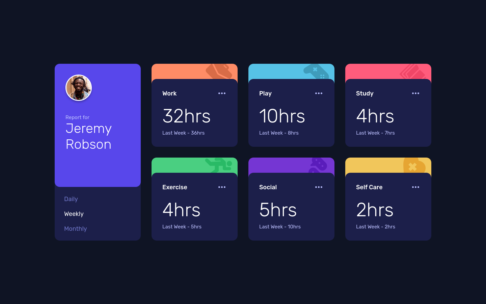

# Frontend Mentor - Time tracking dashboard solution

This is a solution to the [Time tracking dashboard challenge on Frontend Mentor](https://www.frontendmentor.io/challenges/time-tracking-dashboard-UIQ7167Jw). Frontend Mentor challenges help you improve your coding skills by building realistic projects. 

## Table of contents

- [Overview](#overview)
  - [The challenge](#the-challenge)
  - [Screenshot](#screenshot)
  - [Links](#links)
- [My process](#my-process)
  - [Built with](#built-with)
  - [What I learned](#what-i-learned)
  - [Continued development](#continued-development)
- [Author](#author)

**Note: Delete this note and update the table of contents based on what sections you keep.**

## Overview

### The challenge

Users should be able to:

- View the optimal layout for the site depending on their device's screen size
- See hover states for all interactive elements on the page
- Switch between viewing Daily, Weekly, and Monthly stats

### Screenshot

### Links

- Solution URL: [Frontend Mentor Solution](https://www.frontendmentor.io/solutions/time-tracking-dashboard-modern-css-javascript-used-datajson-X1eKiypfal)
- Live Site URL: [Github Pages](https://sprees.github.io/fe-mentor_time-tracking-dashboard/)

## My process

### Built with

- Semantic HTML5 markup
- CSS custom properties
- Flexbox
- CSS Grid
- Mobile-first workflow
- Javascript

### What I learned

This was my first time populating a website with data from a `.json` file. I really enjoy this and can see the potential benefits of this.

I ran into an issue with my `.card--top-bg` background color bleeding through my `.card--time` when adding the same `border-radius` to both. From what I've read, this is apparently an anti-aliasing issue caused by the browser. I ended up increasing the `border-radius` on my `.card--top-bg` to remove it from view. If anyone has any more insight or better solutions for this, I'd love to hear it!

### Continued development

I will continue to focus on semantic HTML, modern CSS, and vanilla Javascript. I feel it is important to master the core languages before abstracting with libraries and/or frameworks. 

## Author

- Website - [Sprees | Github](https://github.com/Sprees)
- Frontend Mentor - [@Sprees](https://www.frontendmentor.io/profile/sprees)
